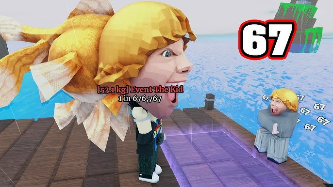

This week we're going to explore an interactive dashboard made by a previous
STAT 541 student! Nicholas Soares works for the Morro Bay National Estuary 
Program, and created this "State of the Bay" dashboard: 

<https://mbnep-state-of-the-bay.shinyapps.io/data_dashboard/>

You should also have the source file which was used to create the dashboard: 
`morro-bay-estuary-dash.qmd`. 

We're going to explore how interactivity is used throughout the dashboard, so 
we recommend you have **both** the source file and the public dashboard opened
up! 

## Overview

1. In the word cloud card, where do the options for "Pick your favorite:" come
from?

```{r}
choices = cloud_select
```


2. What function is used to update the word cloud based on the option input 
by the user?

```{r}
actionButton('submit', 'Add to Word Cloud')
```

## Creek Health

3. Where is the `creek_analyte` input object used? Specifically, how is this
object used?

```{r}
selectInput('creek_analyte', 'Select Analyte to View on Map', 
            c("Nitrate MEQ Scores", "CSCI Scores"))

# a dropdown which is used as the input for the leaflet creek map and filter for that selected type to display on the leaflet map
```

4. What font family are the labels for the creek segments?

DM Sans

5. Where is information for the creek segment clicked on in the `leaflet` map
stored? 

`clicked_plot`

## Bacteria

6. What function was used to add a message about the transformations above 
the buttons for "Select Transformation"?

`radioButtons`

7. What values do the radio buttons take on? 

`raw data`, `square root`, `logarithmic`

8. Are are the plotting data adjusted based on the radio button that is 
selected?

```{r}
dataset <- reactive({
  plot_data <- full_bac
  plot_data <- filter(plot_data, SiteName == input$site)
  if(input$radio == 1){
    plot_data <- plot_data[ , c("Site", "Date", "Entero")]
  } 
  if(input$radio == 2){
    plot_data <- plot_data[ , c("Site", "Date", "Sqrt")]
  }
  if(input$radio == 3){
    plot_data <- plot_data[ , c("Site", "Date", "Log")]
  }
  colnames(plot_data) <- c("Site", "Date", "Var")
  plot_data
})

output$plot <- renderPlot({
  p <- ggplot(dataset(), aes(x = Date, y = Var)) +
    geom_point() +
    geom_smooth(se = F) +
    theme_bw() +
    theme(text = element_text(size = 15))
  
  if(input$radio == 1){
    p <- p + geom_hline(yintercept = 110, 
                        color = "red", 
                        linetype = "dashed") +
      labs(x = NULL, y = "Enterococcus Concentration")
  }
  
  if(input$radio == 2){
    p <- p + geom_hline(yintercept = sqrt(110), 
                        color = "red", 
                        linetype = "dashed") +
      labs(x = NULL, y = "Sqrt(Enterococcus Conc.)")
  }
  
  if(input$radio == 3){
    p <- p + geom_hline(yintercept = log10(110), 
                        color = "red", 
                        linetype = "dashed") +
      labs(x = NULL, y = "Log(Enterococcus Conc.)")
  }
  
  p
  
})

```

The input columns themselves change, but the data itself is not mutated if that's what you mean...

## Phytoplankton 

9. What function is used to allow the user to select the dates that should be
visualized in the plot?

```{r}
dateRangeInput("dates", label = "Date Range",
               start = min(habs$Date), end = max(habs$Date),
               min = "2023-01-01", max = "2025-01-01")
```

10. How are these dates stored? Specifically, are they stored individually? As 
a vector of inputs? As a list?

```{r}
dataset_HAB <- reactive({
  plot_HAB <- habs %>%
    select(Site, Date, input$site_HAB) %>%
    filter(Date >= input$dates[1] & Date <= input$dates[2])
  colnames(plot_HAB)[3] <- "Var" 
  plot_HAB
})

# indicatest that selected dates are stores as a vector of inputs.
```

## Shore Birds

11. Which two zones produce **two** composition plots (an individual plot and a
combined plot) when clicked on? 

6 & 7 



12. What color palette is used for the filled barplot?

Dark2

## Bay Fish

13. The `"Bay pipefish"` is in a different position depending on the habitat
that was selected (i.e., it is third for `Shoreline`, second to last for 
`Tidal Flat`, and third to last for `Open Channel`). How does the ordering of 
the fish species change based on the habitat input?

Changes based on a manually set order, selecting for a specific set of fish. 

14. What color palette is used for the filled barplot?

Paired
