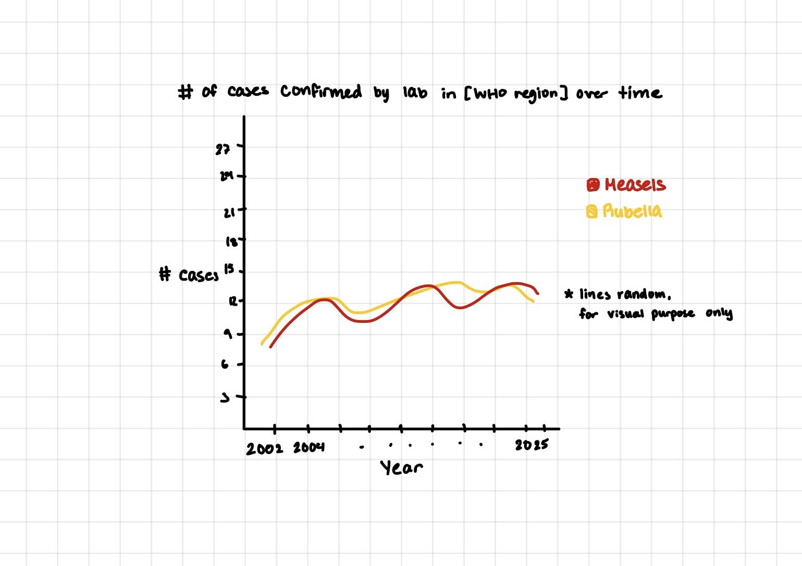
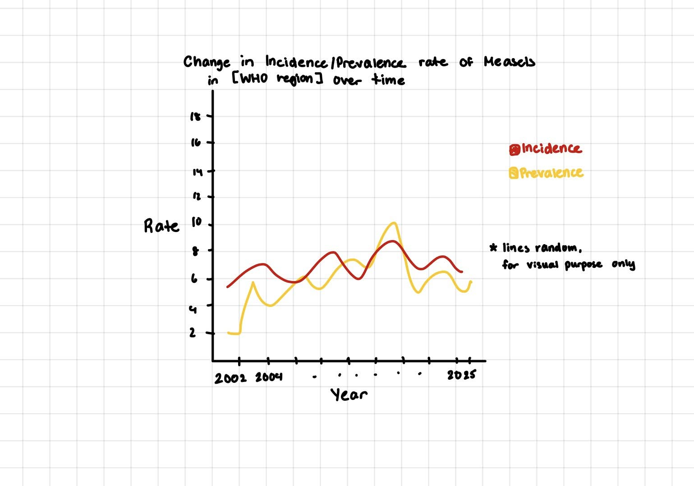

# Context 

## On MMR
Measels is a highly contagious respiratory infection caused by the measels virus. The spread of the virus is often through respiratory droplets and can remain in the air for up to 2 hours. While children are the most commonly affected, those who are unvaccinated, pregnant, or immunocompromised are at an increased risk. Typical symptoms include fever, congestion, cough, red eyes, and rash. Complications have led to hospitalization, pneumonia, or even a brain infection.[^1]

Rubella is also a high contagious viral infection spread through airborne droplets or even direct contact with infected mucus from the nose or throat. Compared to measels, there are similar symptoms, though rubella is most known for its distinct rash pattern. Though Rubella is a mild infection for most, pregnant mothers can pass the infection to their unborn child, which can lead to severe complications. Congenital rubella symptoms include miscarriages, stillbirths, growth delays, deafnes, problems in organ formation includive the heart, or even learning difficulties.[^2] 

Both do not have treatments so if infected, the patient must let the virus run its course. The most common prevention method is through the Measels-Mumps-Rubella (MMR) vaccine which is often given to children between 12-15 months and again between 4-6 years old. This vaccine protects against the three viral infections for life and can prevent Rubella during pregnancies.[^3] 

[^1]: https://www.who.int/news-room/fact-sheets/detail/measles
[^2]: https://www.mayoclinic.org/diseases-conditions/rubella/symptoms-causes/syc-20377310
[^3]: https://www.ncbi.nlm.nih.gov/books/NBK554450/

## On Data Collection
The data comes from the World Health Organization's Provisional monthly measels and rubella data, which contains information on those who were suspected to have the virus, were tested for the virus, and confirmed had the virus. The data includes cases from as early as 2012 and as recent as 2025, collected globally by the organization. The measels case testing follows the WHO's [Measles Programmatic Risk Assessment Tool](https://www.who.int/teams/immunization-vaccines-and-biologicals/immunization-analysis-and-insights/surveillance/measles-programmatic-risk-assessment-tool) where they further collect samples as necessary. The table below breaks down each identified case method following the assessment of a suspected case: 

| Type of Case | Method | 
|--------------|------------------------------------------------------------|
| Clinically Compatible | Patient meets symptom profile, but no sample was collected or no epidemiological link was established. | 
| Epidemiologically Linked | Used when lab testing becomes impractical. Once outbreak is confirmed via laboratory setting, subsequent suspected cases are confirmed via epidemiological linkage. | 
| Laboratory Confirmed | Two main methods: IgM Serology, RT-PCR. Both are rapid test kits where the IgM kit identifies the presence of antibodies for the virus and RT-PCR (real-time polymerase chain reaction) amplifies the RNA of the virus in order to confirm the presence/absence at a molecular level. Other methods include Genotyping and Sanger Sequencing which are done through the Global Measels and Rubella Laboratory Network (GMRLN)[^4].| 

[^4]: https://pmc.ncbi.nlm.nih.gov/articles/PMC11359298/

# Cleaning

Below is the cleaning script provided by the [GitHub repository](https://github.com/rfordatascience/tidytuesday/blob/main/data/2025/2025-06-24/readme.md) which the data came from. The cleaning that has been done to `cases_month` and `cases_year` is primarily cleaning in the column names, converting them to more consistent and understandable names. In `cases_month`, the main cleaning that was done was converting all column names to snake case with `clean_names()`, ensuring consistent naming across all columns. Additionally, the mutate line converts all columns from year to discarded into numerical values. In `cases_year`, the first row of data was established as the column names then did the same snake case naming standardization. The column names were then renamed to column names that described what data is contained in the columns. For example, what used to be column name `na` is now `measels_lab_confirmed` which is far more understandable than what it was called in the raw data. Finally, the first row of data (not the column names that were just renamed) was dropped.

```{r}
#| eval: false
library(tidyverse)
library(here)
library(readxl)
library(janitor)

cases_month <- read_xlsx(here("404-table-web-epi-curve-data.xlsx"), 2) %>%
  janitor::clean_names() %>%
  dplyr::mutate(
    dplyr::across(year:discarded, as.numeric)
  )

cases_year <- read_xlsx(here("403-table-web-reporting-data.xlsx"), 2) %>%
  row_to_names(1) %>%
  clean_names() %>%
  rename(
    country = member_state,
    iso3 = iso_country_code,
    measles_total= number_of_measles_cases_by_confirmation_method,
    measles_lab_confirmed = na,
    measles_epi_linked = na_2,
    measles_clinical = na_3,
    rubella_total = number_of_rubella_cases_by_confirmation_method,
    rubella_lab_confirmed = na_4,
    rubella_epi_linked = na_5,
    rubella_clinical = na_6
  ) %>%
  slice(-1)
```

# Initial Research Questions

Two research questions that could be address with the dataset provided could be: 

* How has the laboratory-confirmed cases changed over time by region?
  * sketch: \
    
* What is the relationship between Measels cases and Rubella cases over time?

Two research questions that could be addressed with supplementary data could be:

* Based on the density of healthcare resources in a fixed area, is there a relationship between the resources and measels/rubella cases?
* How has the [incidence and prevalence rate](https://archive.cdc.gov/www_cdc_gov/csels/dsepd/ss1978/lesson3/section2.html) changed over the years in each of the WHO regions?
  * sketch: \
    

<!-- 
######### CHECKPOINT 1 ##########
By the end of the week, you should have a draft report which: 

describes the context of the data --- DONE

explains what cleaning has been done to the data --- DONE

poses at least two research questions that could be addressed with these data --- DONE

poses at least two research questions that could be addressed using supplemental data --- DONE

sketches out two visualizations that could be made to address the research questions you posed above --- DONE
-->

# Summary Statistics

<!--
Two data summaries that use existing (unmodified) columns in the data

At least one of these summaries need to be produced with a custom function.
At least one of these summaries need to include iteration (either inside or outside of a function).
TO DO @nanamiikii Focus on lab confirmed by country/year @an-avocado Focus on total measels by country/year Keep consistent regardless of final decision.
-->
```{r}
#| echo: false
library(tidyverse)
```

```{r}
#| label: read in data from GitHub

tuesdata <- tidytuesdayR::tt_load('2025-06-24')

cases_month <- tuesdata$cases_month
cases_year <- tuesdata$cases_year
```

```{r}
#| label: function for creating the data summaries 

#using the same summ_stats as practice activity 2
summ_stats <- function(x) {
    
    # if x contains numeric values, return a tibble with the mean, med, sd, IQR
    if (is.numeric(x)) {
        out_df <- tibble(
            mean = mean(x, na.rm = TRUE), 
            median = median(x, na.rm = TRUE), 
            stdev = sd(x, na.rm = TRUE), 
            iqr = IQR(x, na.rm = TRUE),
            n = length(x, na.rm = TRUE)
        )
    # if x contains categorical, return tibble with # of levels in variable 
    } else if (is.factor(x) || is.character(x)) {
        out_df <- tibble(
            n_levels = n_distinct(x)
        )
    } else {
        stop("Inputted values are not numeric or categorical.")
    }

    #return the data frame.
    out_df
}


summarize_stats <- function(df, col = measles_clinical, mode = country) {
  ######### PARAMETERS ##########
  # input: df -- the dataframe of interest 
  # col: column of interest to summarize by: 
  #   measels_suspect, 
  #   measels_clinical, 
  #   measels_epi_linked, 
  #   measels_lab_confirmed, 
  #   measels_total
  # mode: aggregate by options: 
  #   region, 
  #   country, 
  #   iso3, 
  #   year 
  # (default = country)
  ###############################

  # if(!(mode %in% c(country, region, year, month, iso3))) stop("Inputted group mode is not in the data frame. Options: country, region, year, month, iso3")
  #function tests to ensure input validity
  # if(is.data.frame(df)) stop("Inputted value is not a data frame.")

  df |>
    select({{mode}}, {{col}}) |>
    group_by({{mode}}) |>
    summarize(summ_stats({{col}}))
  # taking the part from PA2, 
  # iterate on each group to create summary statistics for each group.
  # map(filtered_df, .f = summ_stats) |>
  #   bind_rows(.id = "id") |>
  #   pivot_longer(!id, 
  #                 names_to = "stat", 
  #                 values_to = "value") |>
  #   pivot_wider(names_from = "id", 
  #               values_from = "value")
}

# cases_month |>
#   select(country, measles_suspect) |>
#   group_by(country) |>
#   summarize(summ_stats(measles_suspect))

summarize_stats(cases_month)
```